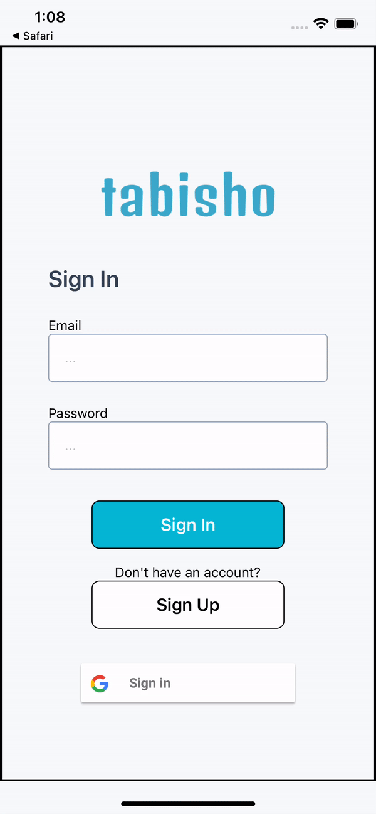
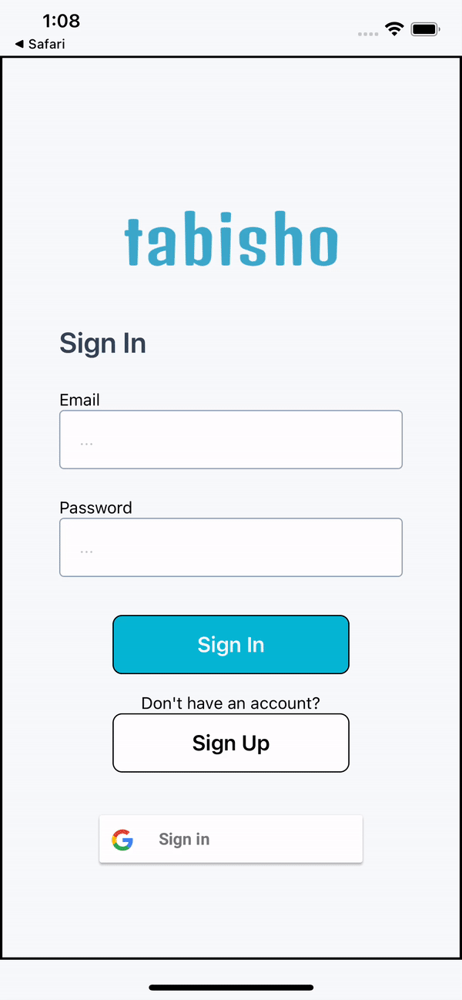
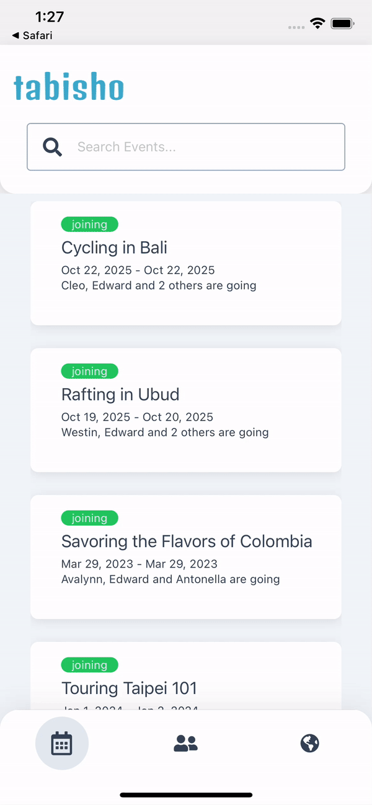
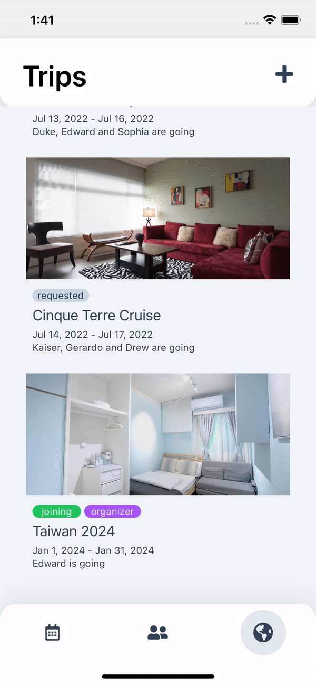
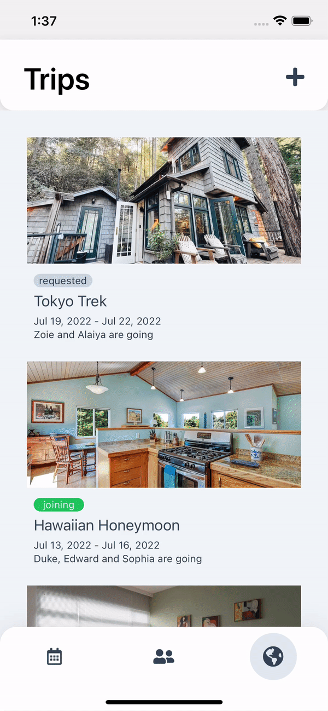
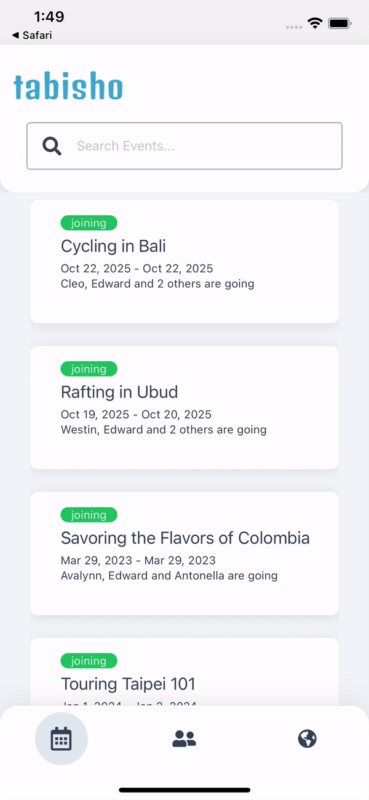

# Adidae

A modernized e-commerce site built for an optimal user browsing experience.

## Author

This project was created by:

[Neil Xia](https://www.github.com/NeilLXia)

### Built With

## Project Summary

This project is a trip-planning application that allows users to manage attendees and trip-details.

## Key Features

- Authentication through Google Firebase
- Dynamically-rendered screens using Redux global state management without additional GET requests
- Live-response RSVP system for trip and events
- User permissions for trip management and RSVP based on access rights

## Gallery

### Login

- Authentication using Google Firebase through email or Google sign-on
- Validate inputs and return alerts for improper emails/passwords

  
  

### Tab Navigation

- Tab navigation for Events, Friends, and Trips
- Animatables animations for tab transitions

  

### Trip Management

- See list of active trips and touch for additional information

  

- Become an organizer and create new trips

  

- Change RSVP status for trips: confirm attendance, request to join, decline, etc...

  

### Event Management

- See list of active events and touch for additional details
- Manage RSVP status for events: confirm attendance, request to join, decline, etc...

  
